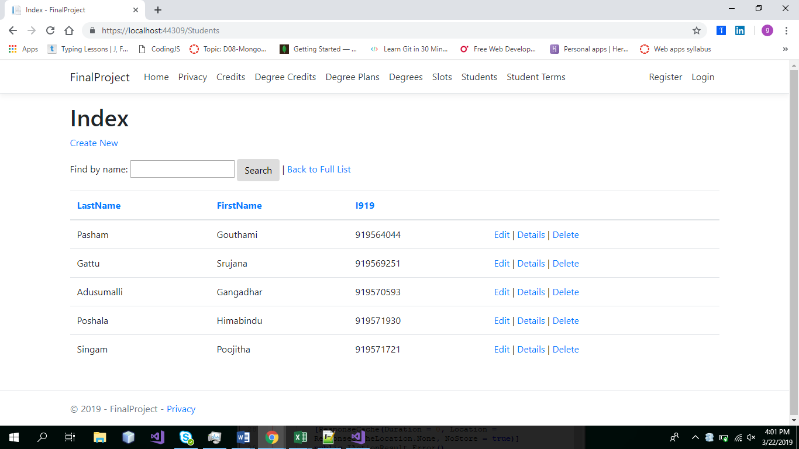
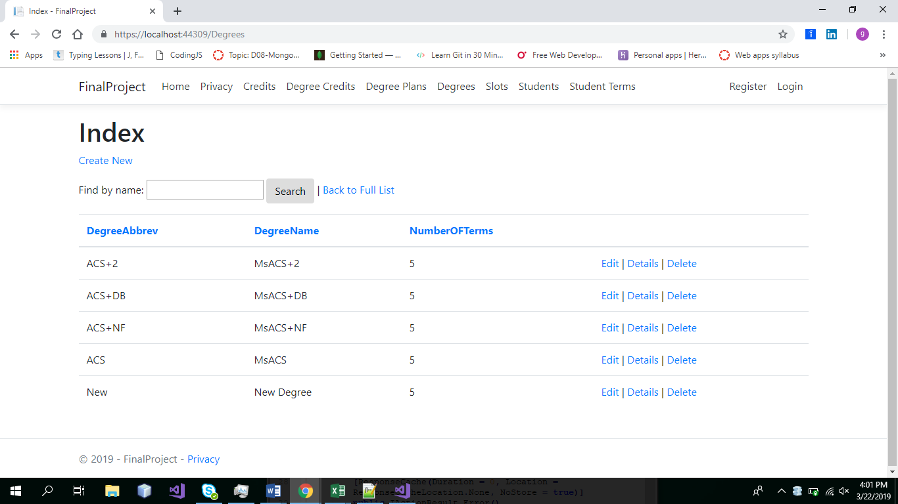

                                       #Project Title: Student Course Registration

This GUI helps students to register their course with easy. Students should simply drag and drop the course names available in the course list into the respective term boxes. As soon as the course is dropped in the term box the student would be registered into the particular course for that term. All the student names are listed in the student tab available in the application. Each student has their respective plans listed on the GUI. 

##List of Developers:

•	Srujana Gattu
•	Gangadhar adusumalli
•	Poojitha Singam
•	Himabindu poshala
•	Gouthami Pasham

##Clone and Run:

Clone the application down to your local machine. Open the solution and run the code this is one way to see the output.

##Link to the repo:
https://github.com/gangadhar993/FinalProject/issues

##Link to Issue tracker:
https://github.com/gangadhar993/FinalProject/issues

##Screen Shots:

##Project Title: Student Course Registration

This GUI helps students to register their course with easy. Students should simply drag and drop the course names available in the course list into the respective term boxes. As soon as the course is dropped in the term box the student would be registered into the particular course for that term. All the student names are listed in the student tab available in the application. Each student has their respective plans listed on the GUI. 

###List of Developers:

1. Srujana Gattu

2. Gangadhar adusumalli

3. Poojitha Singam

4. Himabindu poshala

5. Gouthami Pasham

##Clone and Run:

Clone the application down to your local machine. Open the solution and run the code this is one way to see the output.

##Link to the repo:
https://github.com/gangadhar993/FinalProject/issues

##Link to Issue tracker:
https://github.com/gangadhar993/FinalProject/issues

##Screen Shots:

